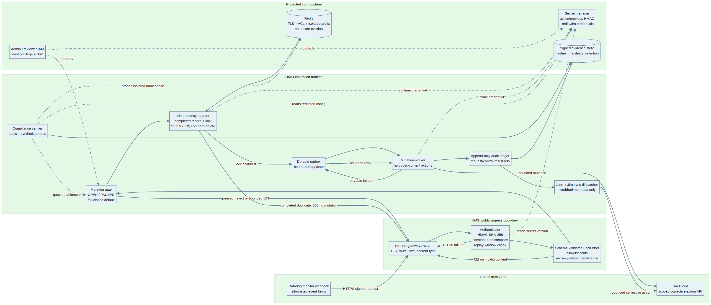
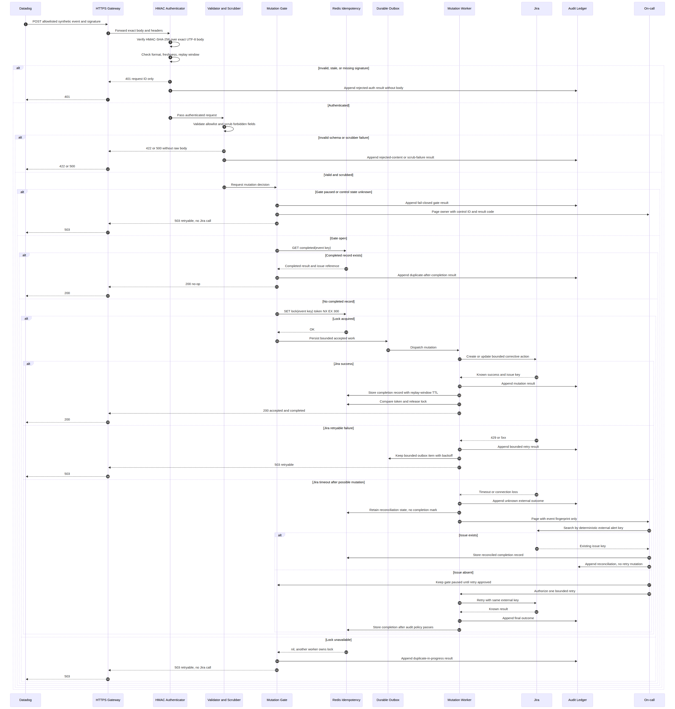

# HMSI Redis and Webhook Compliance Verification Pipeline

**Author:** Manus AI  
**Audience:** HMSI engineering, platform operations, security, privacy, governance, and incident-response teams  
**Status:** Design specification; not a certification, legal opinion, or substitute for an independent SOC 2 examination or qualified GDPR advice  
**Scope:** Automated verification of Redis-backed idempotency, Datadog/webhook ingress, secret handling, access control, auditability, retention, and incident-response configuration for the HMSI Datadog-to-Jira integration.

> **Important boundary:** This pipeline can produce repeatable technical evidence and identify control failures. It cannot by itself establish SOC 2 compliance, determine HMSI’s GDPR role or lawful basis, replace a Data Protection Impact Assessment, or decide whether a breach is legally reportable. Those conclusions require the relevant control owner, privacy lead, and—where appropriate—an independent auditor or qualified counsel.

## 1. Purpose and design principles

The verification pipeline continuously tests whether the production Redis and webhook configuration matches HMSI’s approved security and privacy baseline. It is designed around the existing fail-closed integration: no Jira mutation is permitted when webhook authenticity, idempotency, authorization, audit integrity, or Redis availability is uncertain.

The design follows five principles. First, **patterns, not people**: evidence uses environment, service, control, and event-class identifiers rather than donor, worker, volunteer, contributor, or reporter identities. Second, **evidence minimization**: the verifier collects configuration facts and cryptographic fingerprints, not raw payloads, personal data, credentials, or confidential incident text. Third, **separation of duties**: the same person cannot silently change a secret, approve an exception, and certify the resulting evidence. Fourth, **reversible and fail-closed operations**: a failed check pauses risky mutation or opens a bounded incident; it never compensates by weakening authentication or deleting evidence. Fifth, **auditable automation**: every run, result, override, and remediation transition has a tamper-evident reference.

The AICPA Trust Services Criteria cover Security, Availability, Processing Integrity, Confidentiality, and Privacy and are used for SOC 2 attestation or consulting engagements.[1] The GDPR imposes principles and obligations that are context-dependent, including purpose limitation, data minimization, storage limitation, integrity and confidentiality, privacy by design, processor controls, security of processing, and breach response.[2] This design maps the technical checks to those themes without presenting the mapping as a legal determination.

## 2. Architecture and execution choices

The verifier should run as a deterministic server-side service using the project’s managed backend and built-in recurring execution capability. A webhook-triggered run is used after approved configuration changes; a scheduled run provides continuous assurance; and a manual run is available to an authorized reviewer. The verifier must never run in a browser and must never expose secret values to client code.

| Approach | Tradeoffs | Cost | Setup complexity |
|---|---|---:|---:|
| Managed backend service with scheduled checks, webhook-triggered checks, and a small admin evidence view | Best fit for repeatability, audit evidence, alerting, and parameter management; requires secure provider connectors and secret injection | Low marginal execution cost; provider charges may apply for Redis, logging, and notifications | Medium |
| CI/CD compliance job on every infrastructure/configuration change plus a daily scheduled job | Strong change-gate behavior and easy review in pull requests; weaker live drift detection unless paired with daily checks | Usually low; depends on CI minutes and artifact storage | Medium |
| One-off manual checklist and scripts | Fastest start and useful for initial baseline; does not continuously detect drift, enforce fail-closed behavior, or maintain reliable evidence | Lowest initial cost, highest operational risk | Low |

The recommended implementation is the first approach, supplemented by CI/CD checks for infrastructure and policy changes. It does not require a continuously running process. Scheduled and event-triggered checks are deterministic and should execute in the application’s background job/heartbeat layer rather than through a conversational agent on each run. Minute-level polling is unnecessary; the pipeline should react to approved configuration changes and run at a daily baseline cadence, with an optional six-hour cadence for high-risk production controls.

### 2.1 Logical components

| Component | Responsibility | Data boundary |
|---|---|---|
| Run coordinator | Starts scheduled, change-triggered, and manual verification runs; prevents overlapping runs | Receives control-set version, environment, and request ID only |
| Configuration adapters | Read approved metadata from secret manager, Redis provider, ingress/gateway, webhook configuration, Jira integration, and deployment system | Return normalized facts and redacted status categories |
| Policy engine | Evaluates versioned policy-as-code rules | Reads normalized facts; never reads raw webhook bodies |
| Safe probe runner | Performs synthetic signature, replay, lock, TTL, failover, and authorization tests | Uses synthetic identifiers and isolated test namespaces/project keys |
| Evidence writer | Stores signed manifests, result summaries, evidence references, and control mappings | Stores hashes, timestamps, versions, and redacted outputs |
| Alert and ticket dispatcher | Creates bounded alerts and corrective-action records for failures | Sends control IDs, severity, fingerprints, and remediation links only |
| Reviewer view | Shows posture, evidence age, exceptions, and remediation status to authorized staff | Does not show secret values, raw payloads, or personal data |

## 3. Compliance control model

The pipeline should maintain a control catalog with three layers. The first layer is the **control objective**, such as authenticating webhook requests. The second is the **technical assertion**, such as “the receiver rejects a body whose HMAC does not match the accepted key.” The third is the **evidence assertion**, such as “a signed test result from the current production artifact exists within the required evidence window.” A control is passing only when all required assertions pass.

### 3.1 Control catalog

| Control ID | Control objective | Automated assertion | Primary evidence | SOC 2 themes | GDPR relevance |
|---|---|---|---|---|---|
| SEC-WH-01 | Authenticate webhook origin | Invalid, malformed, stale, and tampered signatures are rejected before body processing | Synthetic probe result; receiver version; ingress policy fingerprint | Security, Processing Integrity | Art. 5(1)(f), Art. 32 |
| SEC-WH-02 | Prevent replay and duplicate mutation | Same deterministic event key produces at most one Jira mutation; completed state survives lock expiry | Replay probe; Redis key-state summary; Jira dry-run reference | Security, Processing Integrity, Availability | Art. 5(1)(f), Art. 32 |
| SEC-RD-01 | Protect Redis transport and access | TLS is enabled; client identity is scoped; public exposure is absent; commands are allowlisted | Provider configuration fingerprint; network policy result; ACL summary | Security, Confidentiality | Art. 25, Art. 32 |
| SEC-RD-02 | Preserve idempotency integrity | Lock acquisition uses atomic `SET NX EX`; release is compare-and-delete; completion TTL exceeds lock TTL | Safe probe and adapter assertion | Security, Processing Integrity | Art. 5(1)(f), Art. 32 |
| SEC-RD-03 | Avoid unsafe eviction and data loss | Redis memory policy cannot silently evict completion records during replay window; backup/restore posture is recorded | Provider policy; backup status; restore-test evidence | Availability, Processing Integrity | Art. 5(1)(f), Art. 32 |
| SEC-KEY-01 | Protect secrets | HMAC, Redis, Jira, and notification credentials are runtime-injected, versioned, non-client-exposed, and absent from logs | Secret metadata; bundle scan; log scrub probe | Security, Confidentiality, Privacy | Art. 25, Art. 32 |
| IAM-01 | Enforce least privilege and separation of duties | Service identities have only required permissions; reviewers and operators are distinct; emergency access is time-bound | IAM export; role review; approval record | Security, Confidentiality | Art. 25, Art. 32 |
| AUD-01 | Maintain trustworthy audit trails | Every accepted, rejected, duplicate, mutation, retry, exception, and override has a bounded audit reference | Append-only manifest; hash chain; retention status | Security, Processing Integrity, Privacy | Art. 5(1)(f), Art. 30, Art. 32 |
| DAT-01 | Minimize and classify data | Payload allowlist excludes personal data, article content, log samples, and confidential incident details | Schema assertion; synthetic payload scan; field inventory | Confidentiality, Privacy | Art. 5(1)(b), Art. 5(1)(c), Art. 25 |
| DAT-02 | Apply retention and deletion controls | Evidence, logs, Redis completion records, and outbox records have documented retention; deletion is authorized and logged | Retention configuration; purge report; exception register | Confidentiality, Privacy | Art. 5(1)(e), Art. 17 |
| IR-01 | Detect and contain security incidents | Authentication spikes, Redis outage, unknown Jira outcomes, audit failure, and secret exposure indicators alert and pause mutation | Alert test; routing record; incident timeline | Security, Availability | Art. 32, Art. 33, Art. 34 |
| GOV-01 | Operate control changes under approval | Every policy/configuration change has reviewer, version, test result, effective time, and rollback reference | Change record; signed manifest; deployment link | All applicable themes | Art. 24, Art. 25, Art. 32 |

The GDPR references above are control relevance indicators, not a complete applicability analysis. For example, Article 30 records of processing, Article 35 DPIAs, international-transfer rules, data-subject rights, and controller/processor contracts require separate privacy work when the integration processes personal data or can be linked to identifiable individuals.

## 4. Evidence and telemetry model

Each verification run creates an immutable **run manifest**. The manifest contains `runId`, environment, control-set version, artifact digest, configuration-version identifiers, start and end timestamps in UTC, verifier version, result counts, and a hash of the ordered evidence records. It must not contain HMAC values, Redis passwords, Jira tokens, raw webhook content, personal data, donor information, worker or volunteer identities, article content, IP addresses unless explicitly approved for a security investigation, or full provider error bodies.

A single evidence record should have the following shape:

```json
{
  "evidenceId": "ev_2026_08_26_000184",
  "runId": "run_2026_08_26_000041",
  "controlId": "SEC-WH-01",
  "environment": "production",
  "status": "pass",
  "severity": "high",
  "observedAt": "2026-08-26T12:00:00.000Z",
  "source": "synthetic-webhook-probe",
  "artifactVersion": "build-sha-redacted-or-approved",
  "configurationFingerprints": {
    "ingressPolicy": "sha256:…",
    "webhookSchema": "sha256:…"
  },
  "assertion": "tampered signature rejected before body processing",
  "resultCode": "HTTP_401",
  "remediationRef": null,
  "retentionClass": "compliance-evidence"
}
```

### 4.1 Privacy-safe telemetry rules

Metric labels must use low-cardinality values such as `environment`, `control_id`, `result`, `provider`, and `severity`. They must not use donor email, worker ID, volunteer name, article title, webhook body, Jira summary, Redis key containing an event digest, or arbitrary Datadog tags. Event digests may be stored only as one-way fingerprints in evidence records, and the original event must not be reconstructable from the digest.

Logs should emit a request ID, control ID, result code, and bounded failure class. Provider responses should be mapped to categories such as `timeout`, `unauthorized`, `rate_limited`, `unavailable`, or `invalid_configuration`. The pipeline must apply a final secret and personal-data scrubber before log export and again before evidence persistence. A scrubber failure is itself a high-severity control failure and must block external dispatch of the affected record.

Evidence should be retained according to the approved governance schedule and legal hold rules. Retention metadata must be explicit, and a purge job must verify that only eligible evidence is removed. Deletion must not remove an active incident, legal hold, open exception, or evidence referenced by an unresolved corrective action.

## 5. Policy-as-code design

Policies should be versioned in the repository, reviewed through protected branches, and evaluated against normalized configuration snapshots. The policy language may be YAML or JSON, but every rule must define an owner, severity, evidence source, remediation, test method, and fail-closed behavior.

### 5.1 Example policy file

```yaml
policySet: hmsi-redis-webhook-v1
appliesTo:
  - staging
  - production
controls:
  - id: SEC-WH-01
    title: Webhook signatures are verified before parsing
    severity: critical
    owner: security-platform
    assertions:
      - path: receiver.auth.hmac.algorithm
        operator: equals
        value: HMAC-SHA-256
      - path: receiver.auth.constantTimeCompare
        operator: equals
        value: true
      - path: probes.tamperedSignature.httpStatus
        operator: equals
        value: 401
      - path: probes.invalidSignature.bodyPersisted
        operator: equals
        value: false
    onFailure:
      action: pause-jira-mutation
      alert: page-security-oncall

  - id: SEC-RD-02
    title: Redis idempotency is atomic and time-bounded
    severity: critical
    owner: platform-operations
    assertions:
      - path: redis.transport.tls
        operator: equals
        value: true
      - path: redis.lock.command
        operator: equals
        value: SET_NX_EX
      - path: redis.lock.ttlSeconds
        operator: between
        min: 120
        max: 600
      - path: redis.completion.ttlSeconds
        operator: gte
        ref: redis.replayWindowSeconds
      - path: redis.lock.releaseMode
        operator: equals
        value: compare-and-delete
    onFailure:
      action: block-production-enable
      alert: page-platform-oncall

  - id: DAT-01
    title: Webhook payload is allowlisted and data-minimized
    severity: high
    owner: privacy-governance
    assertions:
      - path: webhook.schema.unknownFields
        operator: equals
        value: 0
      - path: webhook.schema.forbiddenFields
        operator: equals
        value: 0
      - path: telemetry.rawBodyLogging
        operator: equals
        value: false
      - path: telemetry.personalDataLabels
        operator: equals
        value: false
    onFailure:
      action: reject-and-open-privacy-review
      alert: notify-privacy-owner
```

### 5.2 Required check families

**Webhook authentication checks** should validate HTTPS, approved host and route, request-size and content-type limits, signature header format, HMAC-SHA-256 use, constant-time comparison, timestamp or replay-window validation where supported, authentication before body logging, rejection codes, and absence of raw body persistence. The safe probe set must include a valid synthetic request, altered body, altered signature, missing signature, malformed signature, stale timestamp, oversized body, unknown monitor, and forbidden field.

**Redis checks** should validate TLS, private connectivity, ACL scope, authentication failure behavior, command restrictions, dedicated namespace, memory policy, key-prefix isolation, backup and restore posture, clock/TTL behavior, atomic lock acquisition, compare-and-delete release, completion record TTL, lock-contention behavior, failover behavior, and safe handling of an unknown outcome. The verifier must never run destructive commands against production data. Probes should use a dedicated synthetic namespace with an expiry no longer than the approved test window.

**Secret checks** should verify presence by secret metadata only, minimum entropy policy by manager metadata or provisioning record, distinct environment names, active and previous versions during approved rotation overlap, deployment injection, client-bundle absence, log absence, rotation evidence, revocation evidence, and failure-closed startup when required secrets are missing. A secret value must never be fetched into the policy engine or stored in evidence.

**Access checks** should compare effective permissions against an allowlist for the webhook receiver, Redis client, Jira integration, secret manager, deployment operator, and reviewer roles. The policy should reject wildcard administrative permissions, shared human credentials, unbounded emergency roles, and production writes from test identities.

**Data-governance checks** should compare the webhook field schema, logs, Redis value schema, Jira fields, evidence repository, and retention schedules to the approved data inventory. The check should identify whether any field can contain a direct identifier, special-category data, credentials, free-form incident content, article content, or volunteer/worker information. Findings should be classified for review rather than automatically labeled unlawful.

**Audit and incident checks** should verify append-only behavior, timestamp consistency, UTC normalization, event hash chaining, audit-write-before-mutation policy, redaction, alert routing, duplicate suppression, retry bounds, outbox age, incident linkage, and preservation under rollback. Synthetic alert tests must confirm that a security failure pages the right owner without exposing sensitive payloads.

## 6. Orchestration and run lifecycle

A run begins with an approved trigger and ends with a signed summary. The coordinator must acquire a run lock so two runs cannot mutate the same synthetic namespace or produce conflicting evidence. Configuration snapshots are read first, then static policy checks execute, followed by safe synthetic probes. The policy engine evaluates every assertion, applies the strictest result when assertions conflict, writes evidence, and dispatches alerts only after scrubbing.

| Run type | Trigger | Required checks | Target completion |
|---|---|---|---:|
| Change gate | Approved secret, Redis, ingress, webhook, Jira, or deployment change | Full static checks plus all synthetic probes in staging; production canary subset before enablement | Before change approval |
| Daily assurance | Scheduled UTC run | Full static checks; representative synthetic probes; evidence-age and retention checks | Within one run window |
| High-risk assurance | Secret rotation, Redis failover, auth failure spike, or incident | Authentication, idempotency, access, audit, and containment probes | Within 15 minutes of trigger |
| Manual review | Authorized reviewer request | Selected controls plus evidence refresh | Reviewer-defined |

The run must use an explicit state machine: `queued → snapshotting → probing → evaluating → evidence_written → notifications_sent → completed`. Failure states are `blocked`, `unknown_outcome`, and `failed_redaction`. A `blocked` or `failed_redaction` run cannot be marked passed by a retry without a new evidence record. An `unknown_outcome` result requires reconciliation of the external alert key before the integration can resume mutation.

### 6.1 Pseudocode orchestration

```ts
async function runVerification(input: VerificationInput): Promise<VerificationSummary> {
  const run = await runs.start({
    environment: input.environment,
    policySet: input.policySet,
    trigger: input.trigger,
  });

  try {
    await runLock.acquire(run.runId, 900);
    const snapshot = await adapters.readRedactedSnapshot(input.environment);
    const staticResults = evaluatePolicies(snapshot, input.policySet);
    const probeResults = await safeProbes.run({
      environment: input.environment,
      namespace: `hmsi:verification:${run.runId}`,
      mode: input.environment === "production" ? "canary" : "full",
    });

    const results = scrubAndNormalize([...staticResults, ...probeResults]);
    if (results.some(result => result.status === "failed_redaction")) {
      await mutationGate.pause("failed-redaction", run.runId);
      throw new VerificationError("FAILED_REDACTION");
    }

    const manifest = await evidence.writeSignedManifest({ run, snapshot, results });
    const summary = summarize(results, manifest);

    if (summary.criticalFailures > 0 || summary.unknownOutcomes > 0) {
      await mutationGate.pause(summary.reason, run.runId);
      await alerts.dispatch(scrubAlert(summary, manifest.evidenceRef));
    } else if (summary.highFailures > 0) {
      await alerts.dispatch(scrubAlert(summary, manifest.evidenceRef));
    }

    await runs.complete(run.runId, summary);
    return summary;
  } catch (error) {
    const safeError = classifyWithoutProviderBody(error);
    await runs.fail(run.runId, safeError.code);
    await alerts.dispatch(scrubAlert({ runId: run.runId, code: safeError.code }));
    throw error;
  } finally {
    await runLock.release(run.runId);
  }
}
```

The production implementation must replace pseudocode adapters with provider-specific clients and must keep raw secret values outside the function return path. The verifier should use separate credentials for read-only configuration inspection and synthetic probes. A probe credential must not be able to enumerate, flush, delete, or modify unrelated Redis keys.

## 7. Evidence storage, integrity, and retention

Evidence should be stored in an append-only repository with a relational index and immutable object storage for signed manifests. The relational index should contain `run_id`, `evidence_id`, `control_id`, `environment`, `status`, `severity`, `observed_at`, `artifact_version`, `evidence_uri`, `content_hash`, `retention_class`, `legal_hold`, `exception_id`, and `created_at`. It should not contain raw payloads or secret values.

The manifest should be signed by a verification-service identity or protected with a hash chain. A reviewer can verify that the evidence file has not changed by recomputing the content hash and checking the signature against the published verification key. The evidence repository must log reads and exports, restrict exports to approved reviewers, and apply a retention policy that is longer than the active remediation window but no longer than the approved governance requirement.

A daily retention verifier should report records whose retention metadata is missing, expired records that were not purged, purges blocked by legal hold, and evidence referenced by an open incident. It should create a corrective action for drift rather than deleting broad ranges automatically. Purge operations must be scoped by `retention_class`, eligibility timestamp, environment, and an approved run ID.

## 8. Alerts, remediation, and exception handling

Alerts should be severity-based and bounded. A critical failure pauses Jira mutation and pages the security or platform owner. A high failure opens a corrective-action record and notifies the control owner. A medium failure enters the remediation queue with a due date. A low finding is reported in the next governance review. Alert payloads contain only the run reference, control ID, result code, severity, environment, and remediation link.

| Failure | Immediate action | Required follow-up |
|---|---|---|
| Invalid signature accepted | Pause mutation, preserve synthetic evidence, open security incident | Inspect ingress and receiver versions; rotate HMAC if authenticity is uncertain |
| Redis unavailable or idempotency decision unknown | Block Jira mutation | Restore or fail over Redis; reconcile external alert keys before retry |
| Completion key evicted before replay window | Pause enablement | Correct memory policy/capacity; run replay and duplicate tests |
| Raw payload or personal data found in logs | Stop external alert dispatch for affected path | Scrub, restrict access, assess incident and notification obligations with privacy lead |
| Unauthorized service permission | Disable affected identity or route | Correct IAM, rotate affected credentials, review access logs |
| Audit write failure | Fail closed before mutation, unless approved emergency policy says otherwise | Repair ledger and reconcile any possible external mutation |
| Secret rotation canary fails | Restore previous accepted version only under change approval | Re-test, document cause, shorten overlap if exposure is suspected |

Exceptions must be explicit, time-bound, scoped to controls and environments, approved by the control owner and an independent reviewer, and linked to a compensating control. An exception record should include reason, risk statement, affected assets, start and expiry time, approvers, compensating control, monitoring frequency, and rollback plan. Expired exceptions automatically restore the fail-closed gate; they must not silently renew.

## 9. SOC 2 and GDPR evidence reporting

The weekly security report should summarize control status, failed assertions, evidence age, open exceptions, remediation aging, and incident links. It should avoid personal data and should report counts and patterns rather than names. The quarterly governance package should include the control catalog version, environment scope, change history, evidence completeness, access-review results, retention results, incident tests, and management attestations.

The privacy report should separately identify data categories, processing purpose, system role assumptions, processor/subprocessor dependencies, retention classes, international-transfer questions, rights-request impact, security measures, and breach-assessment workflow. The technical pipeline can flag that a field or log path may contain personal data; the privacy owner must determine the legal consequence and required response.

A control should be reported as **Pass**, **Fail**, **Unknown**, **Not Applicable—approved**, or **Deferred—approved**. `Unknown` is never treated as pass. `Deferred` must have an expiry and compensating control. Historical infrastructure prerequisites that HMSI has explicitly deferred should remain visible in the evidence report as deferred, not silently omitted.

## 10. Implementation sequence

The first release should establish the control catalog, normalized snapshot schema, evidence tables, secret-safe adapters, and staging probes. The second release should add production read-only snapshots, synthetic canary tests, alert routing, and the mutation gate. The third release should add the reviewer dashboard, exception workflow, signed evidence exports, and retention verification. The final release should conduct an independent control walkthrough and update the mapping for HMSI’s actual GDPR roles, data flows, processors, and retention decisions.

| Milestone | Exit criteria |
|---|---|
| Baseline | Current Redis, ingress, webhook, Jira, secret, IAM, logging, and retention configuration is inventoried without exposing secret values |
| Staging verification | All critical synthetic probes pass; negative tests prove fail-closed behavior; evidence manifests verify successfully |
| Production canary | One low-risk monitor is enabled; duplicate, tamper, Redis outage, Jira timeout, and audit-failure paths are demonstrated safely |
| Operational handoff | Owners, alert routes, exception process, rollback path, and evidence-export procedure are approved |
| Independent review | Security and privacy owners review results; an auditor or qualified adviser confirms the control interpretation before any SOC 2 or GDPR claim |

## 11. Acceptance test checklist

| Test | Expected result | Evidence |
|---|---|---|
| Valid synthetic HMAC | Accepted; no raw body logged | Probe result and scrubbed log reference |
| Modified body with original signature | Rejected with `401`; no mutation | Probe result |
| Missing or malformed signature | Rejected before body persistence | Probe result |
| Stale or replayed event | Rejected or deduplicated according to policy | Replay evidence |
| Same event delivered twice | At most one Jira mutation | Idempotency evidence |
| Lock contention | Only lock owner proceeds; late worker cannot delete new lock | Redis probe evidence |
| Redis outage | Jira mutation is blocked | Fail-closed evidence |
| Redis failover | Service recovers without duplicate mutation | Failover evidence |
| Completion TTL | Completion record outlives processing lock and covers replay window | Configuration fingerprint |
| Eviction policy | Completion keys are not silently evicted during replay window | Provider evidence |
| Secret absent | Receiver fails closed at startup or disables mutation | Startup test |
| Secret rotation | New key works, old key expires at approved deadline | Rotation evidence |
| Client bundle scan | No server secret appears in client assets | Build scan |
| Log scrub | No token, raw body, direct identifier, or sensitive field appears | Scrubber test |
| IAM review | No wildcard/admin permissions for service identities | Permission snapshot |
| Audit failure | Mutation is blocked and alert is generated | Failure injection evidence |
| Alert routing | Correct owner receives a bounded alert | Notification evidence |
| Exception expiry | Expired exception blocks or reopens the control | Policy test |
| Evidence tamper | Modified manifest fails signature/hash verification | Verification result |
| Retention eligibility | Only eligible, unheld evidence is purged | Purge report |

All tests must use synthetic monitor IDs, synthetic alert cycle keys, synthetic Jira test records, and isolated Redis namespaces. Production canaries must be low-risk and must not create, publish, delete, or close HMSI public content or user records.

## 12. Final safety review

The design is safe to implement only if the following conditions remain true: the verifier cannot read secret values into evidence; the receiver authenticates before processing untrusted content; Redis failure blocks external mutation; idempotency completion records outlive locks; all retries reconcile unknown outcomes; payloads and logs are allowlisted; alerts are scrubbed; exceptions expire; purge jobs are scoped and reversible until approved; and no compliance result is presented as a certification.

The existing HMSI safety boundary remains in force: the Datadog-to-Jira integration may create or update a bounded corrective-action record, but it must not publish news, restore archived content, release suppression, delete records, close corrective actions, or bypass approval workflows.

## References

[1]: https://www.aicpa-cima.com/resources/download/2017-trust-services-criteria-with-revised-points-of-focus-2022 "AICPA, 2017 Trust Services Criteria with Revised Points of Focus—2022"  
[2]: https://eur-lex.europa.eu/eli/reg/2016/679/oj/eng "EUR-Lex, Regulation (EU) 2016/679 (GDPR)"  
[3]: https://www.edpb.europa.eu/documents/guideline/guidelines-92022-on-personal-data-breach-notification-under-gdpr_en "European Data Protection Board, Guidelines 9/2022 on personal data breach notification under GDPR"  
[4]: https://redis.io/docs/latest/commands/set/ "Redis, SET command documentation"  
[5]: https://cheatsheetseries.owasp.org/cheatsheets/Secrets_Management_Cheat_Sheet.html "OWASP, Secrets Management Cheat Sheet"  
[6]: https://docs.datadoghq.com/integrations/webhooks/ "Datadog, Webhooks integration documentation"  
[7]: https://developer.atlassian.com/cloud/jira/platform/rest/v3/api-group-issues/ "Atlassian, Jira Cloud REST API v3—Issues"  


## 13. Visual architecture and fail-closed sequence

The component architecture below shows the trust boundaries and the permitted direction of data flow. The gateway and authenticator reject unauthenticated traffic before parsing; the validator and scrubber produce an allowlisted internal representation; and the mutation gate blocks external mutation whenever policy, Redis, audit, or reconciliation state is unavailable.



The consolidated sequence diagram shows the normal path and the principal failure paths. In every failure branch, the system either rejects the request, records a bounded audit result, pauses the mutation gate, or requires reconciliation before a retry. No branch authorizes a second Jira mutation merely because a timeout or Redis failure occurred.



The editable Mermaid sources are available as `hmsi-redis-webhook-architecture.mmd`, `hmsi-redis-webhook-main-sequence.mmd`, and `hmsi-redis-webhook-fail-closed-diagrams.mmd`. The first two are renderer-compatible single-diagram files; the third retains the complete source collection for engineering reference.


## 14. Automated integration tests and chaos scenarios

The synthetic integration suite is available at `integrations/fail-closed-mutation-gate.test.mjs`. It validates Redis-unavailable fail-closed behavior, paused-gate persistence after recovery, duplicate suppression, concurrent lock contention, Jira timeout handling, invalid HMAC rejection, monitor allowlisting, and audit scrubbing. The companion scenario matrix is documented in `hmsi-fail-closed-redis-partition-chaos-scenarios.md` and is restricted to isolated staging or disposable test environments.
