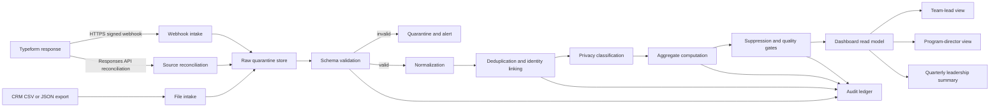

# HMSI Typeform and CRM Retention Data Pipeline Specification
## Secure Ingestion, Aggregation, and Dashboard Delivery

**Purpose:** Define how HMSI will ingest digital pulse-check responses from Typeform and volunteer-support records from CRM exports, transform them into privacy-safe aggregate metrics, and publish them to the cross-team escalation and coaching dashboard.

**Status:** Implementation-ready design specification; no live Typeform, CRM, database, or notification connector is enabled by this document.  
**Primary outputs:** Aggregate escalation trends, coaching themes, support-timeliness metrics, action-register signals, and data-quality status.  
**Primary constraint:** The dashboard shows patterns, not people.

> **Important boundary:** The pipeline must not use individual volunteer data to rank, punish, deny opportunities, or infer commitment, wellbeing, safety, or suitability. Confidential safeguarding, privacy, security, harassment, retaliation, and serious wellbeing concerns are routed separately and are not copied into ordinary dashboard aggregates.

---

## 1. Scope and Architecture Decision

The pipeline has two source classes:

| Source | Input mode | Primary use | Trust boundary |
|---|---|---|---|
| Typeform pulse check | Preferred: signed HTTPS webhook for new submissions; secondary: Responses API reconciliation | Volunteer experience signals, support requests, pause requests, access barriers, and follow-up preference | Third-party event source; verify signature over the raw request body before accepting data |
| CRM export | Approved CSV or JSON export delivered to a restricted intake location | Eligibility/cohort context, team pathway, task/support status, acknowledgement timestamps, and action ownership | File-based source; authenticate delivery, validate schema, quarantine failures, and never ingest more fields than approved |

Typeform’s official documentation confirms that a new response can be delivered to an HTTPS webhook endpoint, that the endpoint should return a 2XX response after receipt, and that signed payloads use the `Typeform-Signature` header with HMAC-SHA256, Base64 encoding, and a `sha256=` prefix [1] [2]. Typeform also retains responses and exposes a Responses API suitable for reconciliation [1] [3].

The recommended design is **event-first plus reconciliation**. A signed Typeform webhook provides timely intake. A scheduled reconciliation job retrieves the source response window and repairs missed, duplicated, or partially processed events. CRM exports are ingested on an agreed cadence because their availability depends on the CRM’s export process.

---

## 2. Logical Data Flow



The raw intake layer is append-only and access restricted. The normalized layer contains only approved operational fields. The dashboard read model contains aggregate values, denominators, suppression state, evidence quality, data freshness, and action references. It does not contain raw free text, direct identifiers, or unrestricted links to source responses.

---

## 3. Source Contracts

### 3.1 Typeform response contract

The Typeform form should use stable field identifiers rather than relying on question text. A versioned mapping file should translate Typeform field IDs into HMSI coded fields.

| Field | Type | Required | Transformation |
|---|---|:---:|---|
| form_id | String | Yes | Allowlist against the approved form ID |
| response_id | String | Yes | Primary idempotency key with form ID |
| submitted_at | ISO timestamp | Yes | Convert to UTC; reject impossible/future-skewed values beyond tolerance |
| respondent_reference | String | No | Hash or tokenize only if approved for cohort linkage; do not expose in dashboard |
| team_pathway | Controlled value | No | Map to approved aggregate pathway; suppress small cohorts |
| q1_clarity | Integer 1–5 or N/A | Yes | Validate range and preserve missing state |
| q2_capacity | Integer 1–5 or N/A | Yes | Validate range and preserve missing state |
| q3_connection | Integer 1–5 or N/A | Yes | Validate range and preserve missing state |
| q4_confidence | Integer 1–5 or N/A | Yes | Validate range and preserve missing state |
| q5_support | Integer 1–5 or N/A | Yes | Validate range and preserve missing state |
| support_request | Controlled value | No | Map to routine support, pause, access, confidential route, or none |
| follow_up_requested | Boolean | No | Use only to create a support-routing task |
| free_text | Text | No | Store in restricted quarantine only if needed; never publish raw text |
| form_version | String | Yes | Preserve for coding and comparability |
| source_received_at | UTC timestamp | Yes | Set at intake |

The response endpoint must validate the raw body before parsing it for signature verification. It should compare the calculated signature using a constant-time comparison, reject invalid signatures with 401/403, reject unsupported form IDs, and return a fast 2XX only after the event has been safely accepted for asynchronous processing. It should not perform expensive aggregation before responding to Typeform.

### 3.2 CRM export contract

The CRM export must be versioned and delivered through an approved restricted channel. The export owner should provide a schema manifest before the first production file.

| Field | Type | Required | Transformation |
|---|---|:---:|---|
| export_id | String | Yes | Idempotency key for the file delivery |
| exported_at | UTC timestamp | Yes | Validate freshness and clock tolerance |
| volunteer_reference | String | Conditional | Tokenize/hash for internal joins; never expose |
| team_pathway | Controlled value | Yes | Map to aggregate group; suppress small cells |
| active_period | Date/range | Yes | Used for eligibility denominator only |
| support_request_id | String | No | Join to a routine support action without exposing the volunteer |
| support_received_at | UTC timestamp | No | Used for acknowledgement timing |
| support_acknowledged_at | UTC timestamp | No | Used for service-level timing |
| action_id | String | No | Join to aggregate action register |
| action_status | Controlled value | No | Map to proposed/open/in progress/complete |
| action_verified_at | UTC timestamp | No | Used for verified completion |
| source_system | String | Yes | Allowlist source name and version |

CRM exports must not include passwords, access tokens, private beneficiary details, case notes, medical details, confidential disclosures, or unnecessary contact fields. If such fields arrive unexpectedly, reject or quarantine the file and notify the export owner without copying the values into general logs.

---

## 4. Secure Intake

### Typeform webhook intake

The public webhook endpoint should be HTTPS-only and protected by the Typeform signature. The secret is stored in the project’s secret manager and is never committed to source control, returned by diagnostics, or written to ordinary logs. The endpoint should enforce a body-size limit, content-type check, form ID allowlist, replay/idempotency check, and request timeout compatible with Typeform’s 30-second delivery timeout [1].

The endpoint processing sequence is:

| Step | Behavior |
|---:|---|
| 1 | Read the exact raw request body without lossy parsing. |
| 2 | Calculate HMAC-SHA256 using the configured webhook secret. |
| 3 | Base64-encode the digest, prepend `sha256=`, and compare to `Typeform-Signature` using constant-time comparison. |
| 4 | Validate content type, size, form ID, response ID, and timestamp. |
| 5 | Check the idempotency key `(form_id, response_id)` against the intake ledger. |
| 6 | Store the accepted raw payload in restricted quarantine with a checksum and received timestamp. |
| 7 | Enqueue normalization and return 2XX quickly. |

Typeform may retry failed deliveries and can disable a webhook after repeated failure conditions [1]. Therefore, the endpoint should return 2XX only when the payload is durably accepted, not when every downstream transformation has completed.

### CRM file intake

CRM files should be uploaded to a restricted intake location or delivered through an approved service account. Each file receives a checksum, export ID, source owner, received timestamp, and schema version. Files must be scanned for type, size, encoding, delimiter, duplicate headers, formula injection strings, and unexpected columns before parsing.

A failed file remains quarantined and does not partially update the dashboard. The export owner receives a bounded error report containing the file reference and schema issue, not sensitive row contents.

---

## 5. Normalization and Coding

Normalization converts source-specific values into HMSI’s controlled vocabulary. The mapping must be versioned so that a future change to a Typeform question or CRM field does not silently break trend comparability.

| Normalized domain | Controlled values |
|---|---|
| support_classification | routine_support, pause_request, access_issue, messaging_concern, confidential_route, uncertain, none |
| coaching_theme | consent_choice, listening_reflection, privacy_minimization, classification, non_retaliation, action_closure, access_workflow, task_clarity |
| action_status | proposed, open, in_progress, complete, blocked, cancelled |
| evidence_quality | verified, partial, insufficient, suppressed |
| status_band | stable, watch, action_required, restricted, unavailable |
| pathway_group | Approved HMSI pathway values only; unmapped values become `unknown` and block unsafe comparisons |

Dates are normalized to UTC. The pipeline stores event time, source receipt time, processing time, and dashboard publication time separately so delays can be diagnosed. Missing values remain missing; they are never converted to zero or “no concern.”

Free-text responses should be classified by an approved coding dictionary or authorized human review. Raw free text is excluded from dashboard views. If an automated classifier is added later, it must produce a coded theme plus confidence/evidence state and must not make safeguarding, wellbeing, or performance judgments.

---

## 6. Identity Linking and Deduplication

The system should use the least identifying join that satisfies the reporting need. Prefer a source-issued response ID or approved pseudonymous reference. Do not join on email address in the dashboard layer.

| Situation | Rule |
|---|---|
| Same Typeform response received twice | Keep the first accepted event and record the duplicate attempt in the audit ledger |
| Same CRM export delivered twice | Deduplicate by export ID plus checksum |
| Typeform response and CRM row refer to same support request | Join through a tokenized internal reference |
| Missing or conflicting identity reference | Keep the record in an unresolved queue; do not guess |
| Corrected source response | Create a versioned correction event; recompute affected aggregates |
| Late-arriving response | Include in the source period only if the approved late-arrival policy allows it; flag restatement |

Every aggregate run should be reproducible from source version, mapping version, coding version, and run ID.

---

## 7. Privacy Classification and Suppression

The pipeline applies privacy controls before aggregation and again before every dashboard read, export, or API response.

Recommended default controls are:

| Control | Specification |
|---|---|
| Minimum cohort size | Suppress team/pathway/location segments below 5 unless HMSI approves a stricter threshold |
| Small-cell protection | Prevent subtraction or cross-filter inference from revealing a person |
| Time-window protection | Combine periods when a narrow window would identify one event |
| Free-text handling | Never show raw comments; publish only reviewed aggregate themes |
| Confidential route | Store status and service-level signal in restricted systems; exclude narratives |
| Role access | Team leads see scoped aggregates; directors see approved cross-team aggregates; specialists see restricted process status |
| Export control | Apply suppression and field minimization to CSV, API, email, and report outputs |
| Re-identification review | Authorized privacy reviewer approves comparisons before circulation |

A dashboard should show **not enough data** or **suppressed for privacy** rather than zero when a metric cannot be safely displayed.

---

## 8. Aggregate Computation

The pipeline should compute a period-level read model from normalized events rather than query raw source tables directly from the dashboard.

### Core aggregation keys

`reporting_period`, `team_group`, `pathway_group`, `signal_category`, `support_classification`, `coaching_theme`, `status_band`, `evidence_quality`, and `suppression_state`.

### Example measures

| Measure | Computation |
|---|---|
| Response coverage | Valid pulse responses ÷ eligible invitations × 100 |
| Routine support request rate | Routine requests ÷ valid classified responses × 100 |
| Median acknowledgement time | Median of acknowledgement timestamp − received timestamp |
| Coaching behavior adherence | Observed behavior met ÷ applicable observations × 100 |
| Action completion rate | Verified complete actions ÷ accepted due actions × 100 |
| Repeated theme rate | Theme-coded observations ÷ valid observations × 100 |
| Escalation routing timeliness | Timely restricted-route acknowledgements ÷ required referrals × 100 |

Each measure stores numerator, denominator, period, source run IDs, mapping version, quality state, and suppression state. Rates must not be rendered if the denominator is missing or suppressed.

### Atomic publication

Aggregation writes to a new run-scoped read model. A dashboard pointer changes to the new run only after all quality and suppression checks pass. If any critical check fails, the previous trusted run remains visible with a stale-data warning.

---

## 9. Orchestration and Cadence

| Job | Trigger | Suggested cadence | Output |
|---|---|---|---|
| Typeform webhook receiver | New response event | Near real time | Accepted intake event |
| Typeform reconciliation | Scheduled | Daily or more frequently if required | Missing/duplicate correction events |
| CRM export intake | File arrival | On delivery | Quarantined or accepted export |
| Normalization worker | Accepted intake event | Continuous/batched | Normalized records |
| Aggregate computation | Scheduled after source window or on demand | Daily; weekly official publication | Versioned read model |
| Quality and suppression gate | After aggregation | Every run | Publish/hold decision |
| Dashboard freshness check | Scheduled | Hourly or daily | Availability status |
| Retention/reconciliation review | Scheduled | Monthly/quarterly | Source-to-dashboard reconciliation report |

A deterministic pipeline should run in the platform’s background job infrastructure rather than as a manual AI task. If the dashboard needs frequent event processing, use an always-available application process or event handler. Do not use a low-frequency scheduled session for minute-level polling.

---

## 10. Monitoring and Alerting

### Pipeline health metrics

| Signal | Warning condition | Action-required condition |
|---|---|---|
| Webhook acceptance rate | Declining acceptance or increased 4XX | Signature failures, endpoint unavailable, or Typeform retries sustained |
| Reconciliation gap | Responses API count differs from accepted ledger | Gap persists after rerun or exceeds approved tolerance |
| CRM freshness | Export later than agreed delivery window | Missing export blocks denominator or action metrics |
| Schema drift | New optional column or unmapped value | Missing required field, duplicate header, or incompatible type |
| Duplicate rate | Unexpected rise above baseline | Possible replay or source retry storm |
| Normalization failure | Small number of quarantined rows | Required mapping failure affecting a whole period |
| Aggregation runtime | Runtime approaching service limit | Run incomplete or publication blocked |
| Dashboard freshness | Warning after expected refresh window | “Data unavailable—do not interpret” state |
| Suppression rate | Higher than normal | Possible cohort shrinkage or over-filtering requiring review |

Alerts should include run ID, source, period, severity, owner, and next action. Logs should contain structured event metadata but never raw secrets, access tokens, full free-text responses, or unnecessary personal data.

---

## 11. Failure Handling and Recovery

### Typeform delivery failure

The endpoint records the failure class, returns an appropriate non-2XX only when the event was not durably accepted, and relies on Typeform retry behavior. A reconciliation job checks the Responses API after the retry window. If the webhook is disabled or unreachable, an authorized operator re-enables it after correcting the endpoint; no data is silently discarded.

### CRM export failure

The file remains quarantined. The prior trusted dashboard run stays published with a freshness warning. The export owner receives the schema error and resubmits a corrected file with a new checksum. Partial rows are never published as a complete reporting period.

### Mapping or coding failure

Unmapped values are held in a review queue. The pipeline should not silently classify them as “none.” A mapping update creates a new mapping version, reruns the affected period, and records a restatement event.

### Dashboard publication failure

The pipeline keeps the last trusted read model active and shows the last successful refresh timestamp. Once the corrected run passes quality gates, the publication pointer switches atomically.

### Data correction

Corrections are append-only events linked to the original source event. Recomputations create a new run ID. The audit ledger records who approved the correction, why it was needed, which periods changed, and whether a previously circulated report must be restated.

---

## 12. Audit Ledger

Record the following event types:

| Event | Minimum fields |
|---|---|
| webhook_received | event ID, form ID, response ID hash, received time, signature result |
| file_received | export ID, checksum, source, received time, schema version |
| validation_completed | run ID, result, error class, row count band |
| normalization_completed | mapping version, result, unresolved-value count band |
| deduplication_completed | run ID, duplicate count band |
| suppression_applied | run ID, rule version, suppressed-cell count band |
| aggregate_published | run ID, period, publication time, quality state |
| aggregate_held | run ID, blocking reason, owner |
| correction_applied | original event reference, new run, approver, reason |
| access_reviewed | viewer role, view, time, purpose code |

Audit records should be immutable or append-only, access restricted, time-stamped in UTC, and retained according to HMSI’s approved data-retention policy. Audit logs must not become a shadow database of raw volunteer narratives.

---

## 13. Dashboard Read Model Contract

The dashboard API should return only fields needed by the authorized view.

```ts
interface AggregateSignal {
  reportingPeriod: string;
  teamGroup: string;
  pathwayGroup?: string;
  signalCategory: string;
  supportClassification?: string;
  metricName: string;
  numerator?: number;
  denominator?: number;
  value?: number;
  statusBand: 'stable' | 'watch' | 'action_required' | 'restricted' | 'unavailable';
  evidenceQuality: 'verified' | 'partial' | 'insufficient' | 'suppressed';
  suppressionState: 'visible' | 'suppressed' | 'insufficient_data';
  dataFreshnessAt: string;
  runId: string;
}
```

The API must enforce role and suppression checks independently of the user interface. It must not accept client-supplied team or role fields as proof of authorization. The backend derives scope from the authenticated session and approved access policy.

---

## 14. Testing and Acceptance Criteria

| Test group | Acceptance criterion |
|---|---|
| Signature verification | Valid Typeform signature is accepted; altered body, wrong secret, missing header, and replay are rejected |
| Webhook idempotency | Repeated response ID creates one normalized event and one audit outcome |
| Schema validation | Missing required fields and incompatible types quarantine without partial publication |
| Mapping stability | A form-version change cannot silently shift historical categories |
| CRM reconciliation | Duplicate files, late files, and corrected files produce deterministic runs |
| Privacy | Small cohorts, free text, direct identifiers, and confidential narratives are suppressed from all views and exports |
| Aggregation | Numerators, denominators, missing data, and late arrivals are correct and traceable to a run ID |
| Authorization | Team leads cannot read another team’s scoped data; ordinary users cannot access dashboard administration or restricted status |
| Failure recovery | Failed publication leaves the last trusted run available with a clear stale-data state |
| Auditability | Every accepted, held, corrected, and published run has an append-only audit record |
| Accessibility | Charts have text equivalents, tables have clear headers, status is not conveyed by colour alone, and keyboard users can reach filters and details |
| Data minimization | Production logs and read models contain no secrets, tokens, raw sensitive narratives, or unnecessary direct identifiers |

A pilot should use synthetic fixtures or an isolated test account. Do not use real volunteer records to test signature failure, suppression, deletion, replay, or escalation behavior.

---

## 15. Implementation Checklist

| Stage | Checklist item | Status |
|---|---|:---:|
| Governance | Approve the source owners, data dictionary, mapping versions, retention policy, and reporting cadence. | [ ] |
| Privacy | Approve minimum cohort size, small-cell protection, free-text handling, restricted-route separation, and export rules. | [ ] |
| Typeform | Create the HTTPS endpoint, configure the webhook secret, allowlist the form ID, and verify signature logic. | [ ] |
| CRM | Approve the export schema, delivery channel, checksum/idempotency rules, and restricted intake location. | [ ] |
| Storage | Create restricted raw quarantine, normalized, read-model, and audit locations with separate access roles. | [ ] |
| Processing | Implement validation, normalization, deduplication, identity tokenization, and versioned aggregation. | [ ] |
| Privacy gate | Apply suppression before publication and test cross-filter and export re-identification paths. | [ ] |
| Monitoring | Add freshness, retry, schema-drift, duplicate, quarantine, suppression, and publication alerts. | [ ] |
| Recovery | Document replay, reconciliation, correction, stale-dashboard, and manual-fallback procedures. | [ ] |
| Testing | Run synthetic webhook, export, failure, authorization, suppression, and accessibility tests. | [ ] |
| Pilot | Publish a limited aggregate pilot with no live sensitive data and obtain privacy/program sign-off. | [ ] |
| Launch | Approve the first production run, verify dashboard freshness, and record the run ID. | [ ] |

---

## 16. Open Decisions Before Implementation

Leadership should confirm the minimum cohort threshold, the approved CRM export owner, the accepted Typeform form version, the official reporting timezone, the retention period for raw response payloads, the restricted-route service level, and the roles authorized to view confidential process status.

The implementation should not begin with live connectors until these decisions are documented and the required secrets are provisioned through the approved secret-management process. This specification intentionally leaves provider credentials, CRM identity fields, exact thresholds, and deployment parameters as controlled configuration rather than hardcoded values.

---

## References

[1]: https://www.typeform.com/developers/webhooks/ "Typeform Developers — Webhooks API"

[2]: https://www.typeform.com/developers/webhooks/secure-your-webhooks/ "Typeform Developers — Secure your webhooks"

[3]: https://www.typeform.com/developers/responses/ "Typeform Developers — Responses API"
